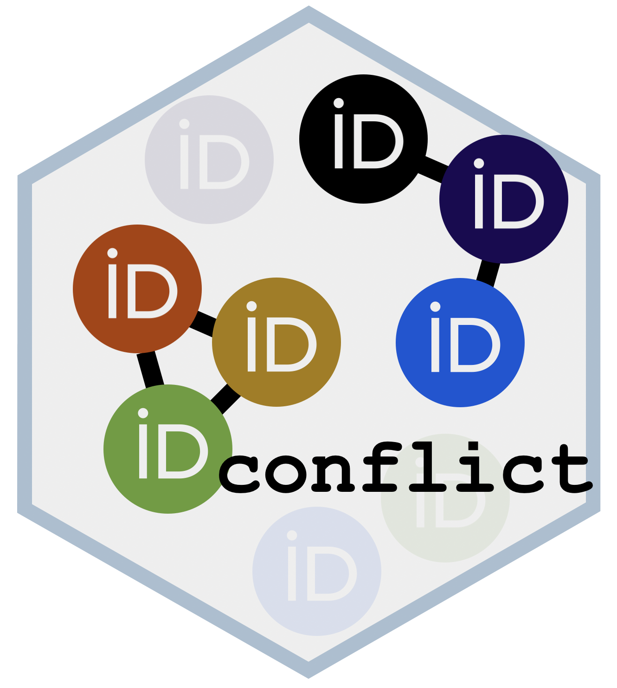

# `conflict` 

`conflict` looks for potential reviewers for a paper based on the abstract (or more), leveraging the [JANE](https://jane.biosemantics.org/index.php) and [OPENALEX](https://openalex.org/) APIs. It then looks for potential conflicts of interests among authors and reviewers using the OPENALEX API. `conflict` was built as a tool to assist [PCI](https://peercommunityin.org/) Recommenders ; the papers handled by PCI are already deposited in a public archive. The data passed to JANE is not stored, according to the author. No email address is parsed in `confict` because these data are not directly provided by [PubMed](https://pubmed.ncbi.nlm.nih.gov) or OPENALEX.

PCI's definition of "conflict of interest" is given [here](https://peercommunityin.org/code-of-conduct/). This is what `conflict` can look for among this code of conduct: - have authors from the submitted paper and potential reviewers co-published in the last `x` year? `x` is set to 2 by default ; you can change that if needed. - are authors and potential reviewers "close colleagues and coworkers" ? PCI says "(in general, “close colleagues and coworkers” are considered people belonging to the same team in the last four years, people with whom they have had recurrent contacts to co-publish articles in the last four years, and have received joint funding in the last four years)"; `conflict` returns last known institutions to help you figure this out.

The package comes with no guarantee and is meant as a tool to help you navigate through the process of finding reviewers, and is no replacement for common sense 😉.

## Installation

``` r
# Install the development version from GitHub:
# install.packages("pak")
pak::pak("ericpante/conflict")
```

## The `conflict` pipeline:

- create a corpus of data from the paper you want to find reviewers for.
- search for potential reviewers from JANE.
- check whether authors (from JANE or not) have a conflic of interest.
